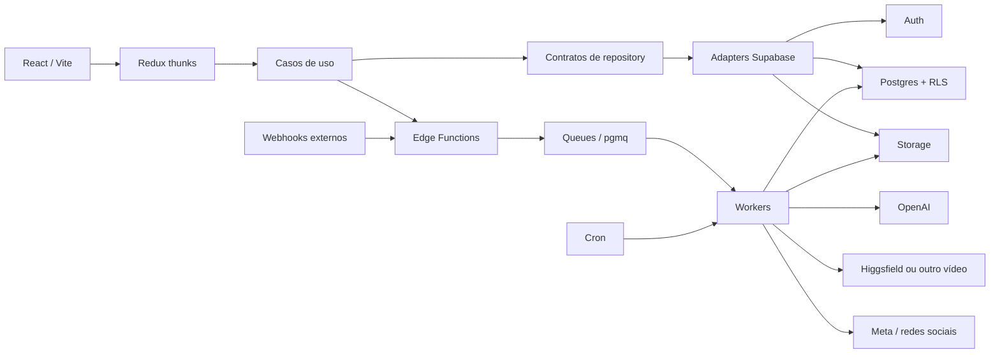
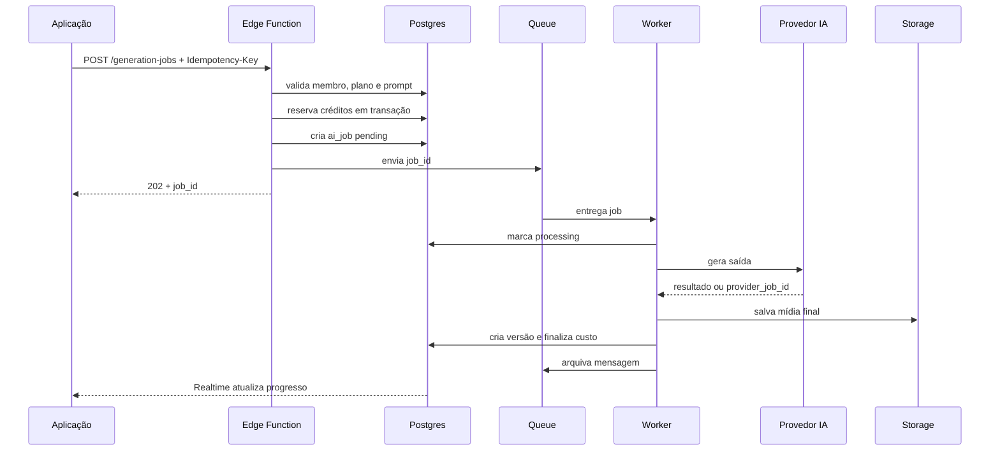

# 01 — Arquitetura proposta

## Objetivo

Preservar as camadas atuais (`domain`, `application`, `infrastructure`, `presentation`) e trocar apenas os adapters mockados por implementações reais. Isso reduz o risco: telas, regras e casos de uso não precisam conhecer Supabase, OpenAI ou Higgsfield.

## Visão geral

## Componentes

### Frontend

Responsável por formulários, preview, progresso, cache da sessão e atualizações em tempo real. Ele pode:

- autenticar com Supabase Auth;
- ler e editar dados pertencentes ao usuário via RLS;
- enviar arquivos por URL assinada;
- assinar eventos de `ai_jobs`, `contents` e `publishing_jobs`;
- invocar Edge Functions autenticadas.

Ele não pode possuir chaves de provedor, usar chave secreta/service role nem calcular o saldo final sozinho.

### Casos de uso

Manter casos de uso explícitos, por exemplo:

- `RegisterUser`
- `CompleteOnboarding`
- `CreateContentDraft`
- `GenerateWeeklyPlan`
- `ConfirmWeeklyPlan`
- `RequestMediaGeneration`
- `ScheduleContent`
- `PurchaseCredits`
- `RetryPublishingJob`
- `CreateTemplateVersion`
- `ActivatePromptVersion`

Cada caso de uso valida regras de domínio e chama um contrato. Em produção, algumas operações serão implementadas por RPC/Edge Function para garantir transação e sigilo.

### Supabase Postgres

É a fonte de verdade para usuários, marca, conteúdos, versões, agenda, créditos, planos, templates, prompts e auditoria. Regras financeiras e transições críticas devem existir também no banco, não apenas no TypeScript.

### Edge Functions

Use Edge Functions como fachada server-side curta e idempotente. A própria documentação do Supabase recomenda trabalhos pesados ou longos em workers; a função deve validar, persistir o job, colocar a mensagem na fila e responder rapidamente.

### Queues e workers

Filas sugeridas:

| Fila | Uso |
|---|---|
| `ai_text` | plano semanal, legenda, hashtags e roteiro |
| `ai_image` | imagens/capas/slides |
| `ai_video` | geração e consulta de vídeo |
| `media_render` | compor template, PNG, ZIP e thumbnail |
| `social_publish` | publicação nas redes |
| `webhook_process` | normalizar webhooks recebidos |
| `notifications` | e-mail e avisos internos |

Mensagem de fila contém somente IDs e contexto mínimo. Payload grande ou sensível fica no banco/Storage.

## Fluxo de geração de conteúdo

## Fluxo de agendamento/publicação

1. O usuário seleciona conteúdo, conta social e data no fuso da marca.
2. `ScheduleContent` recebe `scheduled_local`, `timezone` e converte para `scheduled_at` UTC no servidor.
3. Para agendamento manual, a função reserva/consome **2 créditos** de forma atômica.
4. Um Cron curto procura jobs vencidos e os envia à fila `social_publish` usando bloqueio para evitar duplicidade.
5. O worker obtém a versão imutável aprovada do conteúdo, publica e grava resposta externa.
6. Falha transitória recebe retry com backoff; falha definitiva vai para `dead_letter`/estado `failed`.

## Multi-tenant desde o início

Mesmo que hoje exista uma marca por usuário, use `organizations` e `organization_members`. Isso permite futuramente equipes, agências e vários perfis sem reescrever todas as tabelas. Toda entidade de negócio deve ter `organization_id` e a RLS deve validar a associação do usuário.

Papéis propostos:

- `owner`: dono, cobrança e membros;
- `admin`: configura marca, prompts e agenda;
- `editor`: cria e edita conteúdo;
- `viewer`: somente leitura;
- `system_admin`: administração global da Lumipost, em tabela/claim protegido.

## Decisões importantes

### Banco versus Storage

- Banco: metadados, texto, status, relacionamentos, custos e caminhos.
- Storage: imagens, vídeos, logos, uploads, exports e JSONs grandes de templates.
- Nunca armazenar base64 de imagem/vídeo em `jsonb`.

### Realtime

Assinar apenas linhas relevantes ao usuário. Para geração, a UI observa `ai_job_events` ou a linha do `ai_job`. Evite usar Realtime como fila ou como garantia de execução.

### Estado no Redux

Redux mantém filtros, drafts locais, seleção, modal e cache. Após refresh, reidratar a partir do Supabase. Não persistir access token manualmente; deixe o SDK do Supabase controlar a sessão.

### Ambientes

Manter projetos Supabase separados:

- local via Supabase CLI;
- staging;
- produção.

Migrations são versionadas no Git. Não fazer alterações manuais apenas no dashboard de produção.

